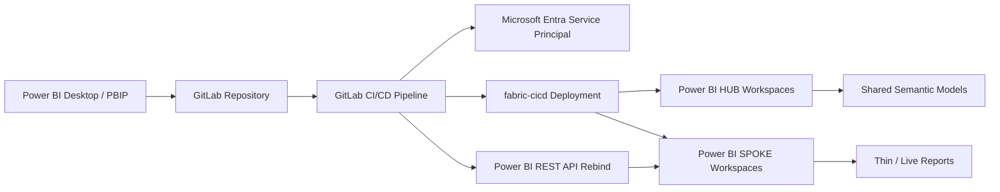
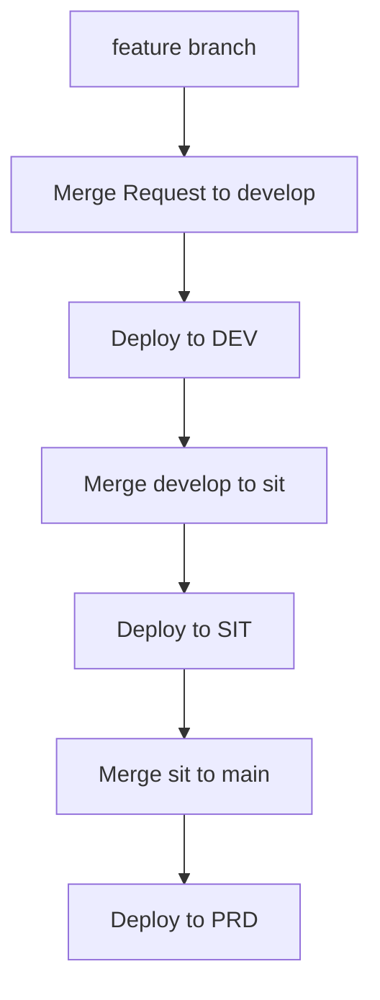

# Power BI GitLab CI/CD Framework

A public reference framework for implementing **Power BI CI/CD with GitLab** using PBIP project files, GitLab CI/CD, Microsoft `fabric-cicd`, Microsoft Entra service principal authentication, and Power BI REST APIs.

This repository is designed for organizations that use **GitLab as their enterprise DevOps platform** but still want a controlled CI/CD process for Power BI semantic models and reports.

> Core principle: **GitLab is the source of truth. Power BI workspaces are deployment targets.**

---

## Why this framework exists

Microsoft Fabric provides native Git integration, but the native workspace Git integration provider list is focused on Azure DevOps, GitHub, and GitHub Enterprise. Many organizations standardize on GitLab for DevOps, approvals, merge requests, CI/CD variables, and deployment pipelines. This framework demonstrates a practical pattern for those organizations.

The framework uses:

- **PBIP / Power BI Project files** for source-control-friendly Power BI content.
- **GitLab repository** for version control.
- **GitLab CI/CD** for validation and environment-based deployment.
- **fabric-cicd** for code-first deployment of PBIP semantic models and reports.
- **Power BI REST API** for report discovery, semantic model discovery, and report rebind.
- **Microsoft Entra service principal** for automated authentication.
- **Deployment manifests** to control what gets deployed.
- **HUB/SPOKE workspaces** to separate shared semantic models from thin reports.

---

## High-level architecture




---

## Generic workspace pattern

Use generic environment-specific workspaces like this:

```text
DEV
├── PBI-DEV-ANALYTICS-HUB
│   └── Sales Analytics semantic model
└── PBI-DEV-SALES-SPOKE
    └── Sales Performance report

SIT
├── PBI-SIT-ANALYTICS-HUB
│   └── Sales Analytics semantic model
└── PBI-SIT-SALES-SPOKE
    └── Sales Performance report

PRD
├── PBI-PRD-ANALYTICS-HUB
│   └── Sales Analytics semantic model
└── PBI-PRD-SALES-SPOKE
    └── Sales Performance report
```

---

## Repository structure

```text
powerbi-gitlab-cicd-framework/
├── README.md
├── LICENSE
├── requirements.txt
├── .gitignore
├── .gitlab-ci.yml
│
├── docs/
│   ├── architecture.md
│   ├── setup-guide.md
│   ├── service-principal-setup.md
│   ├── gitlab-ci-variables.md
│   ├── deployment-flow.md
│   ├── report-rebind.md
│   └── troubleshooting.md
│
├── diagrams/
│   ├── powerbi-gitlab-architecture.png
│   ├── deployment-promotion-flow.png
│   └── workspace-layout.png
│
├── src/
│   └── powerbi/
│       ├── hub/
│       │   └── enterprise/
│       │       └── semantic-models/
│       │           └── Sales Analytics.SemanticModel/
│       └── spokes/
│           └── sales/
│               └── reports/
│                   └── Sales Performance.Report/
│
├── deployment/
│   ├── powerbi-deploy.yml
│   ├── report-bindings.yml
│   └── deployment-rules.yml
│
├── scripts/
│   ├── deploy.py
│   ├── generate_deployment_manifest.py
│   ├── validate_deployment_manifest.py
│   ├── powerbi_rest_client.py
│   ├── fabric_cicd_deployer.py
│   └── rebind_reports.py
│
└── examples/
    ├── sample-gitlab-ci.yml
    ├── sample-powerbi-deploy.yml
    ├── sample-report-bindings.yml
    └── sample-deployment-rules.yml
```

---

## Deployment flow




Branch-to-environment mapping:

| Branch | Environment | Purpose |
|---|---|---|
| `feature/*` | Validation only | Development and review |
| `develop` | DEV | Integration testing |
| `sit` | SIT | System integration / business validation |
| `main` | PRD | Production deployment |

---

## Deployment configuration

The deployment manifest controls what gets deployed:

```yaml
items:
  - name: Sales Analytics
    type: SemanticModel
    workspace_key: analytics_hub
    path: src/powerbi/hub/enterprise/semantic-models/Sales Analytics.SemanticModel

  - name: Sales Performance
    type: Report
    workspace_key: sales_spoke
    path: src/powerbi/spokes/sales/reports/Sales Performance.Report
```

The report binding file controls how thin reports connect to semantic models:

```yaml
bindings:
  - report_name: Sales Performance
    report_workspace_key: sales_spoke
    semantic_model_name: Sales Analytics
    semantic_model_workspace_key: analytics_hub
```

The deployment rules file maps branches and workspace variables:

```yaml
branches:
  develop: DEV
  sit: SIT
  main: PRD

workspaces:
  DEV:
    analytics_hub: ${PBI_DEV_ANALYTICS_HUB_WORKSPACE_ID}
    sales_spoke: ${PBI_DEV_SALES_SPOKE_WORKSPACE_ID}
  SIT:
    analytics_hub: ${PBI_SIT_ANALYTICS_HUB_WORKSPACE_ID}
    sales_spoke: ${PBI_SIT_SALES_SPOKE_WORKSPACE_ID}
  PRD:
    analytics_hub: ${PBI_PRD_ANALYTICS_HUB_WORKSPACE_ID}
    sales_spoke: ${PBI_PRD_SALES_SPOKE_WORKSPACE_ID}
```

---

## Required GitLab CI/CD variables

Create these variables in GitLab under **Settings → CI/CD → Variables**:

### Authentication

```text
AZURE_TENANT_ID
AZURE_CLIENT_ID
AZURE_CLIENT_SECRET
```

### DEV workspace IDs

```text
PBI_DEV_ANALYTICS_HUB_WORKSPACE_ID
PBI_DEV_SALES_SPOKE_WORKSPACE_ID
```

### SIT workspace IDs

```text
PBI_SIT_ANALYTICS_HUB_WORKSPACE_ID
PBI_SIT_SALES_SPOKE_WORKSPACE_ID
```

### PRD workspace IDs

```text
PBI_PRD_ANALYTICS_HUB_WORKSPACE_ID
PBI_PRD_SALES_SPOKE_WORKSPACE_ID
```

Do not hardcode tenant IDs, client IDs, secrets, workspace IDs, dataset IDs, or report IDs in the repository.

---

## Local setup

Create a virtual environment:

```bash
python3 -m venv .venv
source .venv/bin/activate
pip install -r requirements.txt
```

Validate the manifest:

```bash
python scripts/validate_deployment_manifest.py \
  --manifest deployment/powerbi-deploy.yml \
  --bindings deployment/report-bindings.yml \
  --rules deployment/deployment-rules.yml
```

Run deployment locally with Azure CLI / DefaultAzureCredential:

```bash
python scripts/deploy.py \
  --branch develop \
  --use-default-credential
```

Run deployment in GitLab CI/CD using service principal variables:

```bash
python scripts/deploy.py --branch "$CI_COMMIT_BRANCH"
```

---

## How report rebind works

After deployment, thin reports must point to the correct semantic model for the target environment.

Example:

```text
PBI-SIT-SALES-SPOKE / Sales Performance report
        ↓ rebind
PBI-SIT-ANALYTICS-HUB / Sales Analytics semantic model
```

The script performs this sequence:

1. List reports in the target spoke workspace.
2. Find the deployed report by name.
3. List semantic models/datasets in the target hub workspace.
4. Find the semantic model by name.
5. Call the Power BI REST API Rebind endpoint.

Minimal Python example:

```python
session.post(
    f"https://api.powerbi.com/v1.0/myorg/groups/{workspace_id}/reports/{report_id}/Rebind",
    json={"datasetId": semantic_model_id},
    timeout=120,
)
```

See [`scripts/rebind_reports.py`](scripts/rebind_reports.py) for the full implementation.

---

## Public safety checklist

Before using this repository as a public reference, remove or replace:

- Real client names
- Real workspace names
- Real report names
- Real semantic model names
- Tenant IDs
- Client IDs
- Client secrets
- Workspace IDs
- Dataset IDs
- Report IDs
- User emails
- Internal screenshots
- Internal URLs
- Pipeline logs
- Access token output

Use placeholders like:

```text
<tenant-id>
<client-id>
<client-secret>
<workspace-id>
<semantic-model-id>
<report-id>
```

---

## Important notes

This is a reference implementation. Validate it in a non-production tenant before adapting it for enterprise production use.

Recommended production enhancements:

- Use certificate-based authentication if required by your security team.
- Add manual approval gates before SIT and PRD.
- Add post-deployment validation.
- Add workspace drift detection.
- Store deployment logs as pipeline artifacts.
- Add unit tests for manifest validation.
- Restrict PRD deployments to protected branches.

---

## License

This project is licensed under the MIT License. See [LICENSE](LICENSE).
