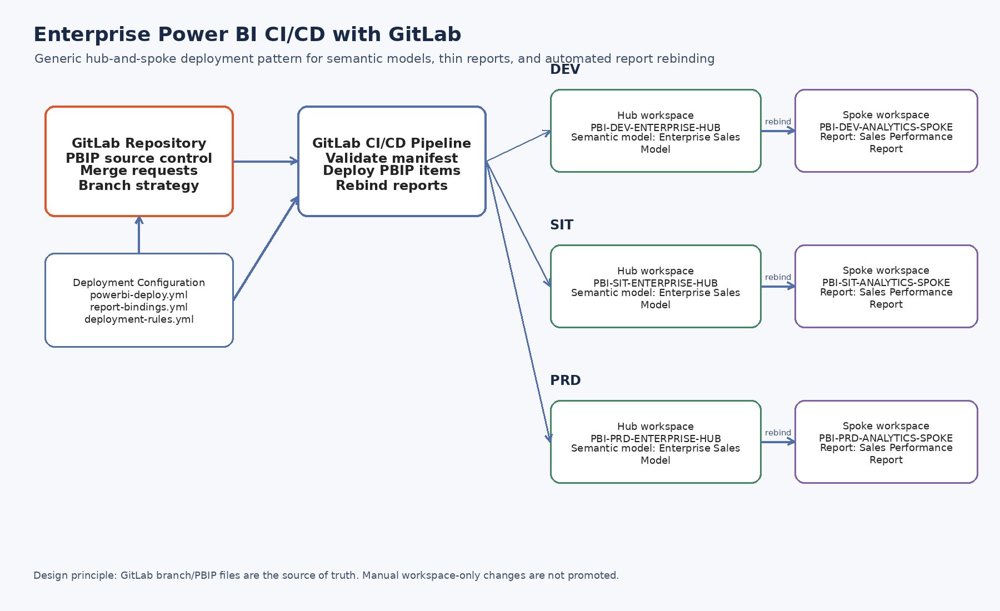
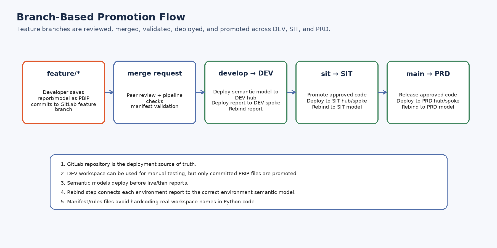

# Building a GitLab-Based CI/CD Framework for Power BI Semantic Models and Reports

## Introduction

Power BI has become a central platform for enterprise analytics, reporting, semantic modeling, and self-service BI. As Power BI adoption grows, organizations need the same engineering discipline around BI assets that they already apply to application code: version control, deployment control, approvals, environment separation, and repeatable releases.

Microsoft Fabric provides native Git integration for supported Git providers. However, many enterprises use GitLab as their standard DevOps platform. This creates a common question: how can an organization implement a reliable Power BI CI/CD process when GitLab is not the native Git provider connected directly inside the Power BI or Fabric workspace?

This article explains a practical framework for implementing Power BI CI/CD with GitLab using PBIP project files, GitLab CI/CD, Microsoft's fabric-cicd Python library, and the Power BI REST API.

## Problem statement

In many organizations, Power BI development still depends heavily on manual publishing from Power BI Desktop into DEV, SIT, UAT, or PRD workspaces. This can create several challenges:

- No clear source of truth
- Manual deployment risk
- Difficult rollback process
- Environment drift between DEV, SIT, and PRD
- Thin reports pointing to the wrong semantic model after deployment
- Limited governance around who changed what and when
- No consistent approval process before production release

The goal of this framework is to make GitLab the source of truth and make Power BI workspaces deployment targets.

## Solution overview

The framework uses a GitLab repository to store PBIP project files, deployment configuration, and Python deployment scripts. GitLab CI/CD validates the deployment manifest, deploys semantic models and reports to the correct workspaces, and then rebinds reports to the correct semantic model in the target environment.

The deployment pattern follows a HUB/SPOKE design:

- HUB workspace: shared semantic models
- SPOKE workspace: thin reports connected to HUB semantic models

## Architecture



The main components are:

- Power BI Desktop for creating PBIP files
- GitLab repository for source control
- GitLab CI/CD for validation and deployment automation
- Microsoft Entra service principal for authentication
- fabric-cicd for PBIP deployment
- Power BI REST API for report rebind
- DEV, SIT, and PRD Power BI workspaces

## Generic workspace layout

```text
DEV
├── PBI-DEV-ANALYTICS-HUB
│   └── Sales Analytics semantic model
└── PBI-DEV-SALES-SPOKE
    └── Sales Performance report

SIT
├── PBI-SIT-ANALYTICS-HUB
│   └── Sales Analytics semantic model
└── PBI-SIT-SALES-SPOKE
    └── Sales Performance report

PRD
├── PBI-PRD-ANALYTICS-HUB
│   └── Sales Analytics semantic model
└── PBI-PRD-SALES-SPOKE
    └── Sales Performance report
```

## Repository design

The repository separates Power BI source files, deployment configuration, and automation scripts.

```text
powerbi-gitlab-cicd-framework/
├── src/powerbi/
├── deployment/
├── scripts/
├── docs/
├── diagrams/
└── .gitlab-ci.yml
```

The `src/powerbi` folder stores PBIP semantic models and reports. The `deployment` folder controls which objects are deployed and where. The `scripts` folder contains Python automation for deployment and report rebind.

## Deployment control using manifest files

The deployment manifest controls the objects managed by CI/CD.

```yaml
items:
  - name: Sales Analytics
    type: SemanticModel
    workspace_key: analytics_hub
    path: src/powerbi/hub/enterprise/semantic-models/Sales Analytics.SemanticModel

  - name: Sales Performance
    type: Report
    workspace_key: sales_spoke
    path: src/powerbi/spokes/sales/reports/Sales Performance.Report
```

This is important because not everything manually published to a DEV workspace should automatically move to SIT or PRD. Only PBIP content committed to GitLab and listed in the deployment manifest is promoted.

## Branch-based promotion



A simple promotion model can be:

| Branch | Target |
|---|---|
| `develop` | DEV |
| `sit` | SIT |
| `main` | PRD |

Feature branches can be used for validation and review before merging into `develop`.

## Report rebind after deployment

One of the most important parts of this framework is report rebind.

In a HUB/SPOKE model, the report and semantic model may be deployed to different workspaces. After deployment, the report must point to the semantic model in the correct environment.

Example:

```text
PBI-SIT-SALES-SPOKE / Sales Performance report
        ↓ rebind
PBI-SIT-ANALYTICS-HUB / Sales Analytics semantic model
```

The framework uses a binding file:

```yaml
bindings:
  - report_name: Sales Performance
    report_workspace_key: sales_spoke
    semantic_model_name: Sales Analytics
    semantic_model_workspace_key: analytics_hub
```

The Python script finds the report by name, finds the semantic model by name, and calls the Power BI REST API Rebind endpoint.

## Why this approach is useful

This approach helps organizations that use GitLab achieve a controlled Power BI ALM process without requiring native GitLab workspace integration inside Fabric.

Key benefits:

- GitLab becomes the source of truth
- Deployment is repeatable
- DEV, SIT, and PRD workspace routing is controlled
- Manual DEV testing can still happen, but only committed PBIP content is promoted
- Reports can be rebound automatically to the correct semantic model
- Service principal authentication avoids user-based deployment dependency
- The process can be extended with approvals, validation, and governance checks

## Public reference implementation

The full code for this framework is available in the companion GitHub repository. The repository includes:

- GitLab CI/CD pipeline example
- Python deployment scripts
- Manifest validation script
- Report rebind script
- Generic workspace configuration
- Documentation and diagrams

## Final thoughts

Power BI development should be treated with the same discipline as software development. For enterprises using GitLab, this framework provides a practical way to bring version control, automated deployment, approvals, and environment consistency into the Power BI delivery lifecycle.
